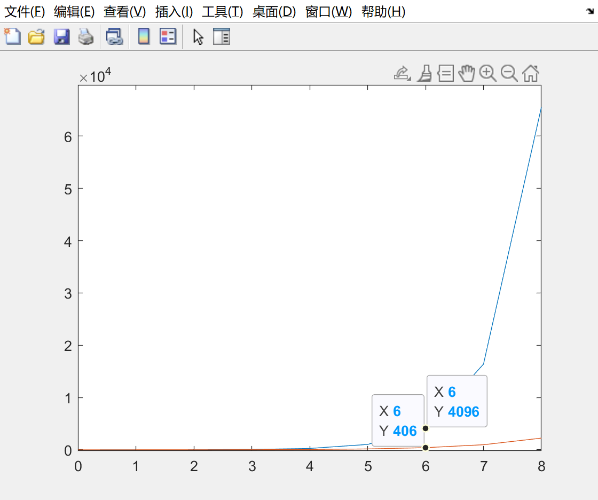

[TOC]

### 0、基础知识

#### 0.0 C++ STL版本

C++标准库是有多个版本的，要知道我们使用的STL是哪个版本，才能知道对应的栈和队列的实现原理。

那么来介绍一下，三个最为普遍的STL版本：

1. HP STL 其他版本的C++ STL，一般是以HP STL为蓝本实现出来的，HP STL是C++ STL的第一个实现版本，而且开放源代码。
2. P.J.Plauger STL 由P.J.Plauger参照HP STL实现出来的，被Visual C++编译器所采用，不是开源的。
3. SGI STL 由Silicon Graphics Computer Systems公司参照HP STL实现，被Linux的C++编译器GCC所采用，SGI STL是开源软件，源码可读性甚高。

HP STL C++ STL的第一个实现版本，开源，其他版本的STL一般都是以HP STL为蓝本开发的

P.J. Plauger STL 不开源，被Visual C++ 采用

SGI STL 开源 被LINUX GCC采用， 代码精简

#### 0.1 stack和queue

C++标准定义了三种容器适配器：stack，queue和priority_queue。其中，stack和queue底层默认用deque实现。priority_queue底层默认用vector实现。stack被定义在<stack>头文件中，后两者被定义在<queue>头文件中。

stack可以指定vector,deque,list
queue可以指定deque,list
stack只要求push_back(),pop_back()和back()，因此除了array和forward_list都可以作为底层容器来构造。
queue要求push_back(),pop_front(),front()和back(),因此不可以用vector,可以用deque和list

###### 指定底层容器

```
std::stack<int,std::vector<int>> st;
std::queue<int,std::list<int>> que;
```

###### stack

```c++
a.push(x);
a.pop();
a.top();//访问栈顶元素（尾部元素）

a.size();
a.empty();
```

###### queue

```c++
a.push(x);
a.pop();
a.front();//访问队首元素
a.back(); //访问队尾元素

a.size();
a.empty();
```

注意:

stack和queue不能像vector一样通过列表初始化指定，只能一个一个地进行元素添加。

```C++
queue<int> que = {1,2,3,4}; //错误！！！
//正确写法：
queue<int> que;
que.push(1);
que.push(2);
que.push(3);
```


STL深究

访问元素和增删元素是我们在使用STL容器时最关心的两个方面

```c++
1. 访问
访问分为随机元素访问和首尾元素访问
list 和 forward_list不支持随机元素访问，list支持首尾元素访问，forward_list仅支持首元素访问。
2. 增删元素
    只要涉及元素的增删，array全部都不支持。
    增删元素也分为首尾增删和随机位置增删
forward_list不提供push_back()操作 为什么？
vector和string不提供push_front()操作 复杂度为O(n)
deque的元素并不是存储在连续内存中的，首尾可以插入

```

==todo==

探索deque是如何实现O(1)完成头部元素的插入

**STL的强大之处在于其提供的方法时间复杂度是一致的。**


#### 0.2 heap

heap这个数据结构是专门作为priority_queue的底层数据结构而存在的。要了解priority_queue的实现机制，首先要理解heap这个数据结构。

我们首先要明确：若要实现一个priority_queue，其底层的数据结构应该完成哪些工作。与queue一样，priority_queue也需要插入、删除、取极值三种操作。但却别在于，priority_queue要保证队首元素一定是最大/最小的。

一种思想是在插入时就进行某种排序，另一种思想是随便插入，在要取得极值元素时再进行搜索。

假设我们采用list作为priority_queue底层容器

```
插入：插入到最后即可 O(1)
删除：需要找到极值元素再进行删除 O(N)
取极值：同上 O(N)
```

假设我们先排序再插入，仍然使用list

```
插入：找到合适的插入点，维持序列的増序或倒序 O(N)
删除：头结点即是极值元素 O(1)
取极值：同上 O(1)
```

采用第二种做法，虽然插入的复杂度变高，但是删除和取极值操作都获得了最优时间复杂度。

> 用vector的deque可以吗？
>
> 首先分析vector：
>
> vector并不支持pop_front() 
>
> deque:
>
> deque拥有和vector string一样的快速随机访问能力。但是deque在增删性能上好像更优一些。vector仅在序列末端增删元素是常数时间复杂度，deque在两端增删元素都是常数时间复杂度，但是在中间增删元素仍然很慢。
>
> 

但是，好像某些程序员们都对上面这种程度的时间复杂度还不满意

如果使用BST呢？

极值：logn

pop：logn

push: logn

如果使用堆？

极值：log1

pop: logn

push: logn

**heap的实质是一个永远维持最大/最小值在root的完全二叉树。**

push_heap

pop_heap

make_heap

#### 0.3 prioirty_queue

### 一、题目清单

#### 1.1 对栈和队列数据结构的基本理解

##### 232. 用队列实现栈

##### 225. 用栈实现队列

#### 1.2 应用题

##### 20. 有效的括号

##### 22. 括号生成

给定n,代表括号的对数，求n对括号组成的所有有效排列。例如

```c++
输入：n = 3
输出：["((()))","(()())","(())()","()(())","()()()"]
```

有效括号的特点:

从头开始遍历，在每个位置`(`的数量永远大于等于`)`的数量。

`)`永远都跟离它最近的`(`结合，因此只要保证`)`的数量不超过`(`时，添加`)`必然能找到与其配对的`(`



##### 1047. 删除字符串中的所有相邻重复项

给定一个字符串s，消除字符串中所有的相邻项，返回消除后的字符串。例如：

```C++
输入："abbaca"
输出："ca"
```

#####  使用其他STL数据结构作为栈？

栈的基本操作，push_back(),pop_back(),back(),string全部都支持,因此使用string作为`stack<char>`使用是完全没有问题的.

由此引出另外一个思考，其实如果只是为了单纯的使用一个栈的话，我们根本没有必要定义一个stack类，使用string, vector, deque, list都是可以的

之所以使用stack,是因为stack是纯粹的栈，它并不支持其他操作。如果我们使用其他数据结构，很可能因为操作不当造成使用上的错误。但是！如果对自己非常有自信的话，不使用stack是完全没有问题的！

本题实质上就是string的“对对碰”，因此直接使用string还省去了stack->string的步骤

map 和 multimap 被定义在 `<map> `中

unordered_map 和 unordered_multimap 被定义在`<unordered_map>`中，set同。

##### 150. 逆波兰表达式求值

给定`vector<string>`表示的逆波兰表达式，计算其结果。

分析：逆波兰表达式是后缀表达式，运算符位于运算对象的后面。其计算过程非常简单：遇到数字就将其入栈，遇到运算符将两个元素出栈，计算后将结果入栈。

这道题可以延伸出另一个题目：

##### 将中缀表达式转换为后缀表达式（逆波兰表达式）

我们在计算机中输入的表达式全部都是中缀表达式，这是便于人们理解的一种方式，但是对计算机来说并不好理解。因此，计算机的处理方式是先将中缀表达式转换为后缀表达式，再对后缀表达式进行计算。

我们给定`vector<string>`表示的中缀表达式，求`vector<string>`表示的后缀表达式。

**为什么表达式要用vector<string>这一看起来不常规的类型表示，而不直接使用string?**

使用vector<string>可以区分运算对象和运算符。例如负号，如果用string表示，我们很难判断-代表的是减号还是负号。但是用vector<string>表示的话，负号被划分到数字之前，如“-11”，而减号仅为单独的“-”，这样就很好的区分了减号和负号。

那这里其实还有另外一个问题：**如何将string表示的中缀表达式转换为vector<string>表示的中缀表达式呢？**


单调队列

优先队列

