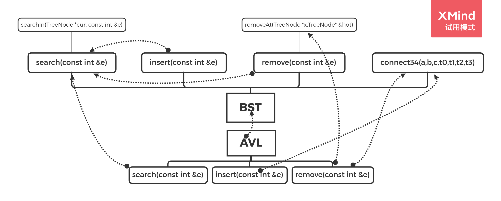

## AVL

### 定义

AVL树是BST，它在BST的基础上增加了一条要求：任意节点的左右两棵子树高度差不超过1。因此保证了BST的搜索时间复杂度为$O(logN)$

### 搜索算法

与BST使用相同的搜索算法

### 插入算法

插入某个节点后，可能导致树处于不平衡状态，因此需要调整树的结构使其满足AVL树的约束。

**处于失衡状态的树的结构有什么特点？**

**新插入的节点必然为树的叶子节点**

**我们只需要调整处于失衡状态的最深的那个节点g的结构。**

这要求我们能够保证调整后，新树的绝对高度并不发生改变。

**处于失衡状态的节点必然处于根结点到新插入节点的路径之间。**

### 删除算法

### 34重构：connect34():从宏观角度看待树结构变化

所有的插入和旋转都可以用34重构的方式来解决。

### AVL函数调用

