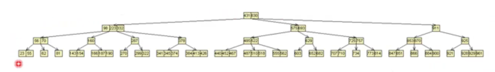
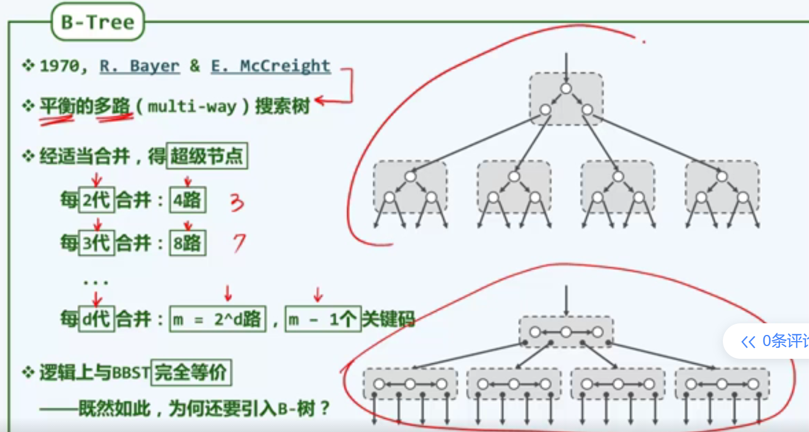
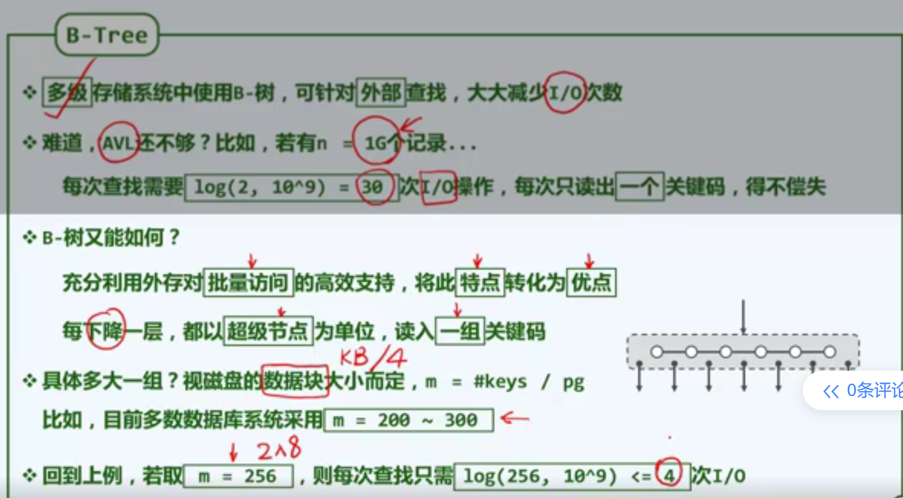
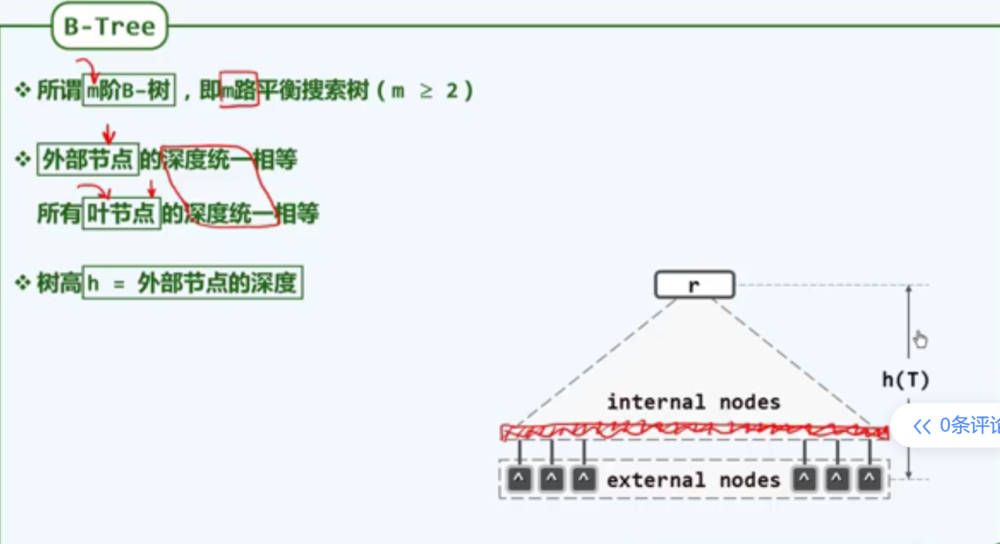
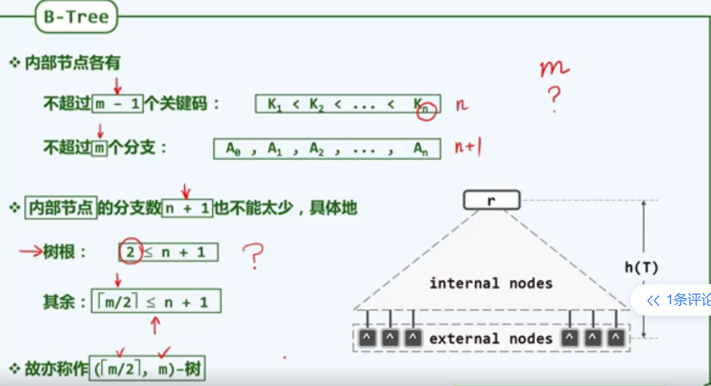
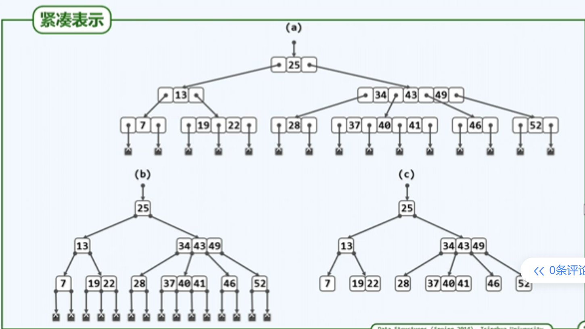
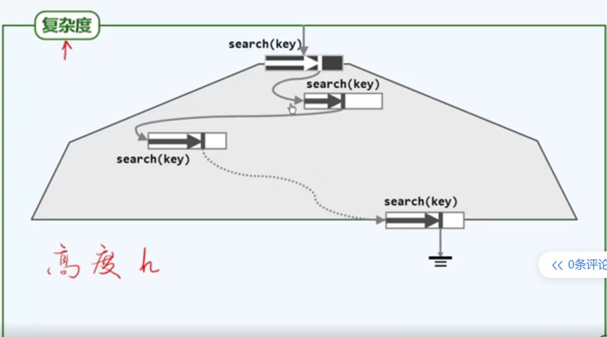
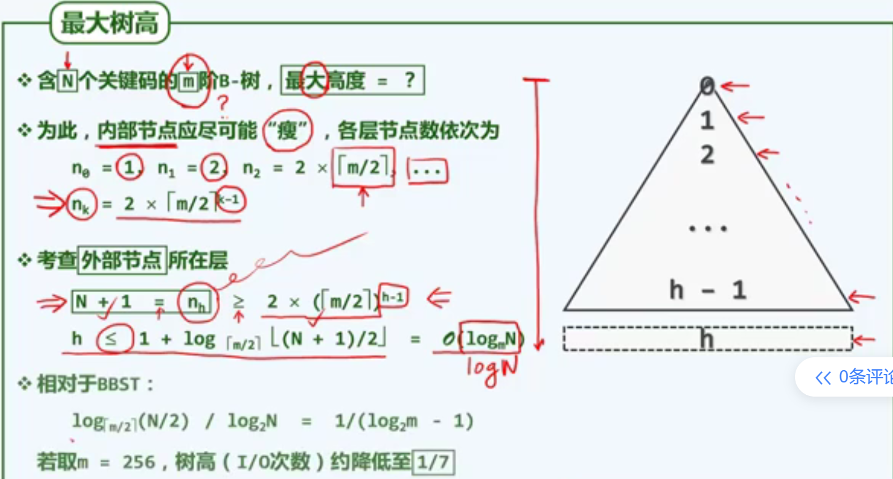
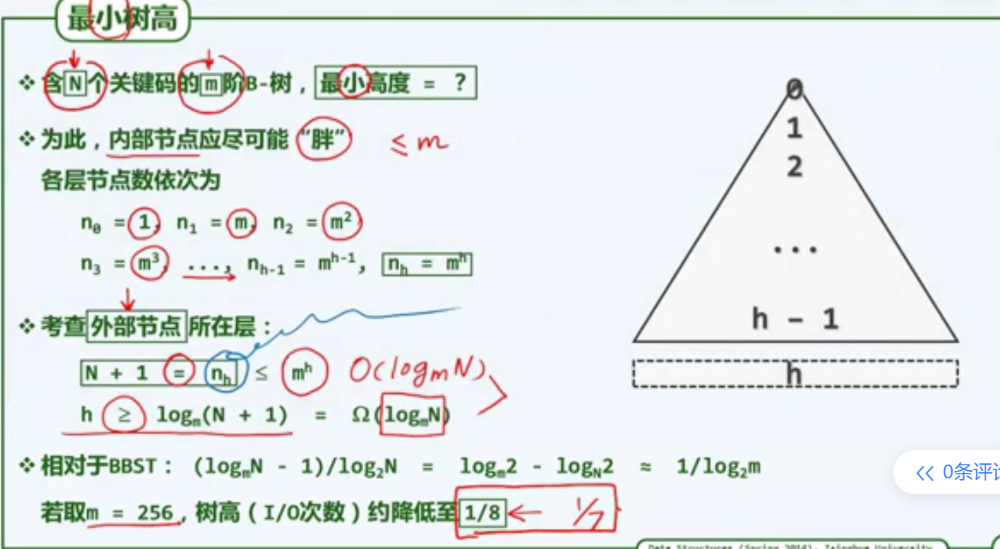

### B-树结构




观察这棵B树，我们发现以下特点：

1. B树每个节点不只有一个数字
2. B树是高度平衡的，整体显得宽且矮
3. B树每个节点不只有两个子节点（B树不是BST）

B树的插入与删除过程也涉及树结构的调整。



B树是一个**多路搜索树**

实际上多路搜索树可以由二路搜索树通过合并得来。

假设我们将两代的节点进行合并。原先的父节点居中，左右节点分列其两侧。这样形成了一个超级节点，这个超级节点不止含有一个节点，而是包括父子节点的两代节点。同时，这个超级节点继承了子代所有的指向关系，形成了四路搜索树。

三代、四代、N代节点的合并也遵循相同的原则。



B树通过合并节点形成超级节点，大大降低了树的高度，因此也就减少了IO访问的次数。同时利用

==外存？？？？==

每一个树节点都是使用new进行的操作

程序只能访问内存，不能直接访问外存。

也就是说B树的应用场景，并不在于程序之内的搜索。

==但是从真正的search时间复杂度来看，有提高的吗？==



所谓的m阶B-树，指的是m路平衡搜索树。如4阶B-树，指的就是每两代合并成超级节点形成的B-树。

B树另外一个特征是叶节点深度统一相等。也就是所有的叶节点都存在于树最下面一层的位置。

相应的，外部节点（叶节点的空子节点）的深度也是统一相等的。

但是，与其他树中不同的是，B-树的高度指的是外部节点到根结点的高度。==这种设定有什么意义呢？==

B树的外部节点可能指向另一存储区的B-树，因此我们不能在B-树中省略外部节点，外部节点同时也会计算入高度。



B-树的阶数m都代表什么含义呢？

从已有知识来推导，**对于m阶B-树，其每个节点的关键码不得超过m个，同时每个节点最多拥有m个分支。**

**此外，B-树中的m还规定了每个节点分支数的下限是$\lceil m/2 \rceil$​。**值得注意的是，对于根结点此条规则并不适用。根结点分支数至少可以有两条。==这是为什么呢？原因需要我们后面再去探寻.这与B-树的插入算法有关==

综上所述，m阶B-树还可被称为(m/2,m)-树。括号里的数字代表分支的下限和上限。例如我们有(4,7)树，(4,8)树，(3,6)树，(3,5)树，(2,4)树。其中，(2,4)树与红黑树有不解的渊源，留待我们后面去探寻。

对于每个节点，B-树也给出了所含关键码的下限：**对于普通节点，每个节点不得少于m/2下整个关键码，而对于根结点，至少含一个关键码。** 

总结：

| 节点类型 | 每个节点关键码个数范围          | 每个节点分支数量范围    |
| -------- | ------------------------------- | ----------------------- |
| 根结点   | [1,m-1]                         | [2,m]                   |
| 普通节点 | ==[$\lceil m/2 \rceil-1$​,m-1]== | [$\lceil m/2 \rceil$,m] |

```
例题：对于的高度为3的5阶B-树，其关键码数量的上限和下限分别是多少？
所谓上限，即每个节点有足够多的关键码，分枝数量也达到上限。而所谓下限，即关键码数量和分支数量取的下限。
上限：m=5, (m-1)*(1+1*m+1*m*m) = m3-1 = 125-1=124
下限： 1*1+(1*2+1*2*3)*2 = 17
```



如上展示了一棵4阶B-树。为了清楚地表示关键码的左右节点，使用一个空白节点指向其左节点和右节点。但其实我们可以简化这种表示方式，将空白节点用一个点表示。位于关键码左侧的点指向其左孩子，位于关键码右侧的点指向其右孩子。

==有一个比较迷惑的点是上面的1922节点。== 13指向它们中间的位置，我不知道是画错了还是就应该是这样的。我感觉是它画错了。



我们来看搜索操作的时间复杂度。主要由两部分构成：I/O操作的时间和在vector中search的时间。由于I/O操作是非常慢的，因此主要的时间都用于I/O操作。那么树的高度h与关键码的数量N之间存在什么关系？

### B-树树高h,与AVL的比较



我们现在计算m阶B-树，在含有N个关键码时，形成的树高度的上限和下限。

为了实现最大树高，我们希望每个节点的关键码数量尽可能的少，且分支个数也尽可能的少。

对于第0层，至少含有一个$1$个节点；

对于第1层，至少含有$1*2$个节点；

对于第2层，至少含有$1*2*\lceil m/2\rceil$​​个节点；

由此类推，对于外部节点这一层，也就是第h层，至少含有$1*2*\lceil m/2\rceil^{h-1}$​个节点。

==前面我们已经知道，对于含有N个关键码的B-树，其外部节点的个数为N+1,怎么证明呢？==

> 证明：对于含有N个关键码的B-树，其外部节点的个数为N+1。
>
> 我们用N表示节点的数量，C表示关键码的数量，有：
>
> $C_h = N_h$​​  （外部节点的关键码数量与节点数量相等）
>
> $N_h = C_{h-1}+N_{h-1}$​
>
> $N_{h-1} = C_{h-2}+N_{h-2}$​
>
> ...
>
> $N_1 = C_0+N_0$
>
> 联立以上等式，我们有：
>
> $N_h = C_{h-1}+C_{h-2}+...+C_0+N_0$
>
> 我们同时有：
>
> 根据题意，我们同时有：
>
> $C_{h-1}+C_{h-2}+...+C_0 = N$ （关键码的数量为N）
>
> $N_0 = 1$​   (根结点只有一个)
>
> 因此，可以得出：
>
> $N_h = N+1$

由此我们得到不等式：$ N+1 >= 2* \lceil m/2\rceil ^{h-1}	$

化简之后得到结果$ h<= 1+log_{\lceil m/2\rceil}(N+1)/2$

我们知道，B-树的树高代表其I/O操作的最大次数，将h与AVL树的平均搜索复杂度$log_2N$相比，这里我们取m为常规的256（让一个节点填满一个磁盘的block）==一个block一般是多大？==
$$
\frac{1+log_{\lceil m/2\rceil}(N+1)/2} {log_2N} = \frac{1+log_{128}(N+1)/2} {log_2N} = \frac{log_{128}(N/2)} {log_2N} = \frac{log_{2^7}(N/2)} {log_2N} = \frac{1}{7}*\frac{log_{2}(N/2)} {log_2N} = \frac{1}{7}*\frac{log_{2}N-1} {log_2N}
$$
做比后得到结果
$$
\frac{1}{7}*\frac{log_{2}N-1} {log_2N}
$$
当N足够大时，$\frac{log_{2}N-1} {log_2N}$近似为1，因此B-树的最大高度相比AVL树降低了1/7



对于最小树高的计算如上图所示。

要求得最小树高，需要让每一层容纳足够多的关键码，且分支数量也要拉满。

对于第0层，最多容纳1个节点；

对于第1层，最多容纳$1*m$个节点；

对于第2层，最多容纳$1*m*m$个节点；

对于第h层，最多容纳$m^h$个节点

由此我们得到不等式$m^h>=N+1$，化简得到$h>=log_m(N+1)$

B-树最小树高与AVL树的树高作比较：
$$
\frac{log_m(N+1)}{log_2N} = \frac{log_{256}(N+1)}{log_2N} = \frac{1}{8}*\frac{log_{2}(N+1)}{log_2N}
$$
$$

当N足够大时，$\frac{log_{2}(N+1)}{log_2N}$趋近于1，因此B-树的最小数高约为AVL树高的1/8。

总结：通过以上求B-树最小树高和最大数高的过程，我们发现同关键码N下，256阶B-树的高度介于AVL树树高的1/8~1/7之间，因此大大降低了其搜索的I/O调用次数。


### B-树的插入

B树的插入算法：首先search到待插入的位置，插入之后检测该节点是否满足B-树的约束，即关键码的个数是否超过m-1。

若插入节点满足B树约束，结束插入。若不满足约束，说明该节点含有m个关键码，需要对B-树进行形变。

我们称这种操作为上溢操作。具体描述如下：

选取溢出节点的中点$\lceil m/2 \rceil$插入到该溢出节点的父节点中。其左右部分的节点分别作为其左孩子和右孩子。

检测插入后的父节点是否满足B-树约束，若满足，结束整个插入过程；若仍不满足，重复对父节点进行上溢操作直至满足B-树的节点约束条件。

若根结点溢出，则将中点关键码作为新的B-树根结点，其左右两侧的节点作为第一层的两个孩子。到这里我们可以体会到为何B-树规定根结点的支路个数可以至少为两个而不是$\lceil m/2 \rceil$​个。正是为了保证插入操作的合法性。


### B-树的删除

##### B-树的删除算法

1. 调用search(e)找到待删除关键码所处的节点v

2. 若v为空，说明e不存在，返回false；否则说明e存在，继续执行算法。

3. 若v中的关键码数量满足B-树约束，算法结束。否则要处理下溢。

4. 若v是根节点，令_root = v->child[0]；delete v 算法结束。

5. 若v不是根结点：

   - 找到v的左兄弟和右兄弟（如果存在的话）

   - 如果左右兄弟至少有一个关键码数量$>\lceil m/2\rceil-1$​，证明其有能力“借出一个关键码”，执行旋转操作。

   - 否则，执行合并操作。

##### 旋转算法

1. 若左侧兄弟满足旋转条件，则：
   - 在v->key首端插入其左父关键码的值，v->child最前侧插入left->child尾元素
   - 令父关键码为left->key尾元素
   - 在left->key和left->child中删除尾元素
2. 若左侧兄弟不满足旋转条件，但右侧兄弟满足旋转条件（人为设定的，当然也可以让右侧的优先级高于左侧
   - 在v->key末尾插入其右父关键码的值，v->child末尾插入right->child首元素
   - 令父关键码为right->key首元素
   - 在right->key和right->child中删除首元素

##### 合并算法

> 证明：$\lceil m/2 \rceil-1+\lceil m/2 \rceil-2+1<m$
>
> 

若左右两个兄弟都无法满足旋转条件，则只能进行合并。

> 两种算法能够应对所有的情况分析：
>
> 首先，任何节点，只要不是根节点，都必然至少有一个左兄弟或者右兄弟。因为B-树的约束条件对每个节点的分支数量有下限要求：2（根结点）或者$\lceil m/2\rceil$。
>
> 既然无法满足旋转要求，那证明其左右兄弟全部无法满足旋转条件，即(left && left->key.size()>$\lceil m/2 \rceil -1$) || (right && righ->key.size()>$\lceil m/2 \rceil -1$) 那么其关键码的数量必然等于$\lceil m/2\rceil-1$​
>
> 也就是说，左右兄弟的关键码数量要么超过B-树所定义的下限，要么等于下限。刚好这两种情况能被旋转和合并处理。

1. 若与左兄弟进行合并
   - 先后在left->key末尾插入左父关键码的值和v->key的所有元素
   - 在left->child末尾插入v->child的所有元素
   - 在p->key中删除左父关键码和其右分支，同时delete v

2. 若与右兄弟进行合并
   - 先后在v->key插入右父关键码的值和right->key的所有元素
   - 在v->child末尾插入right->child的所有元素
   - 在p->key中删除右父关键码和其右分支，同时delete right

合并之后的结果是在父节点中删除了一个关键码，这可能会导致父节点出现关键码数量减少的问题。

这时我们将v设为p，返回到步骤3。
