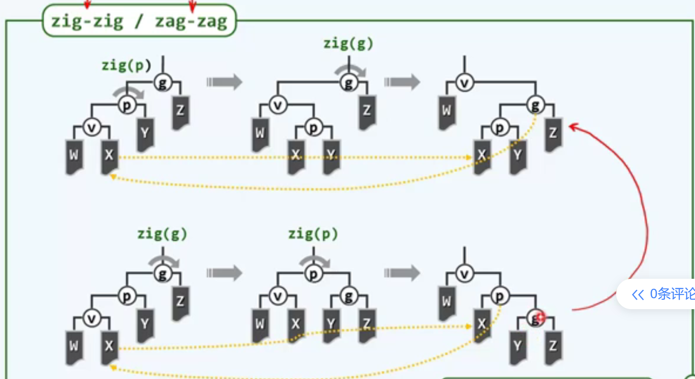

## 伸展树（Splay Trees）

### 伸展的思想

##### 局部性

list元素的访问效率与其秩（简单地理解为index）有关。

秩小，也就是排在list前面的元素，访问效率更高；而秩大，排在list后面的元素，访问效率更低。

如何利用**局部性**提高访问效率呢？

我们将刚刚访问到的元素移到list最前面。这样使用一段时间后，list靠前位置即为最近经常用到的元素；而list后面即为最近不怎么用到的元素。因此，利用这种局部性，访问效率可以获得提高。

BST也可以借鉴这种思想。靠近根结点的节点访问效率更高，而靠近底部的元素访问效率更低。

##### 逐层伸展

利用在AVL树中旋转的思想：zig and zag，我们可以反复使用这一技巧，直到将v节点转移至树根。

==有这个变换的功夫，第二次查询访问都要结束了吧？==

将这一过程连起来看，很像是一个伸展的过程。

##### 逐层伸展的最坏情况

我们假设这样一种情况：

按照1,2,3,4,5,的顺序循环访问，那么访问所需的时间复杂度从O(N),O(N-1)一直到O(1)，每个周期累计的时间复杂度为$O(N^2)$

均摊到每次访问，时间复杂度为O(N)

这样的复杂度不仅远低于AVL树所能实现的$logN$,甚至退化到了线性数据结构vector和list的程度。

> AVL树的最大查找时间为O(logN)，插入和删除

所幸的是，这并不是因为我们的伸展策略出了问题，而是我们没有运用好它，我们仅差的是画龙点睛的一笔！

### 双层伸展

Tarjan提出双层伸展的概念。它涉及三层，节点v，父节点p，祖父节点g。根据他们的位置关系，呈现出四种拓补结构：zig-zig,zig-zag,zag-zig,zag-zag

首先来看异侧伸展的状态，v先与p进行一次zig变换，再与g进行一次zag变换。

但仔细分析这个过程，我们发现这里描述的双层伸展只是与连续两次的逐层伸展并无什么区别。甚至这个过程还等效于AVL树中的双旋！难道不是吗？

真正的化龙点睛之笔在子孙同侧伸展。拿zig-zig举例，Tarjan不先将v与p进行zig变换，而是将g与p进行zig变换，将变换后的根结点p再与v进行一次zig变换。

通过比较两次单层伸展与双层伸展的最终拓扑结构，我们发现有一些不同。

我们继续拿”一撇“的举例，在应用tarjan建议的调整方法之后，第一次访问最深的元素，树高减少一半；再继续访问最深的

元素，树高又减少将近一半，如此优化了恶意者每次都访问最深的节点时的性能

对Tarjan的方法进行总结后我们发现，整棵树的收缩如同一株含羞草，一旦恶意者试图访问最坏的那个节点，它会迅速地将自己收缩，所对应访问节点的路径长度随即减半。我们可以通过数学上严格证明，采用Tarjan采用的方法后，访问节点的均摊时间复杂度减小到了O(LOGN)

如果v只有父亲没有祖父，这种情况只会出现一次且此时p节点必为整棵树的根结点，我们视情况，将v与p进行旋转，使得v称为新根结点。从全局角度上来看，每次伸展中这种情况至多出现一次，不影响大局。

那么双层旋转具体该如何实现呢？

