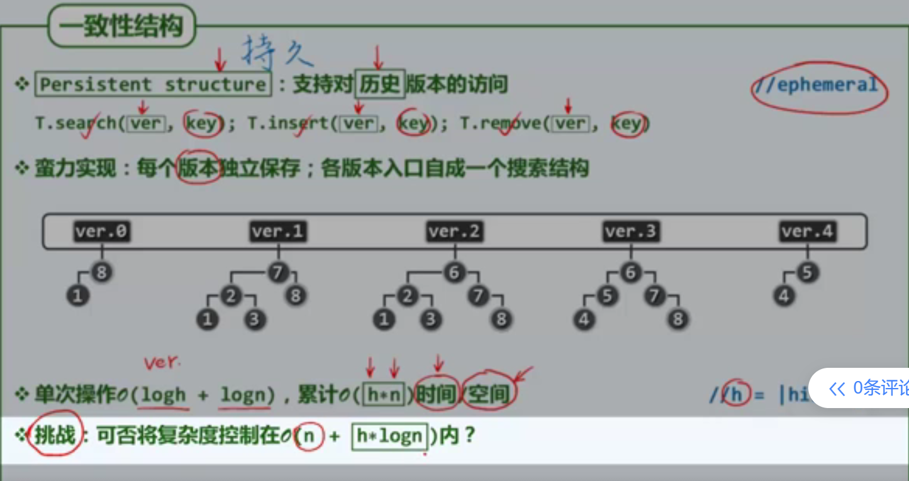
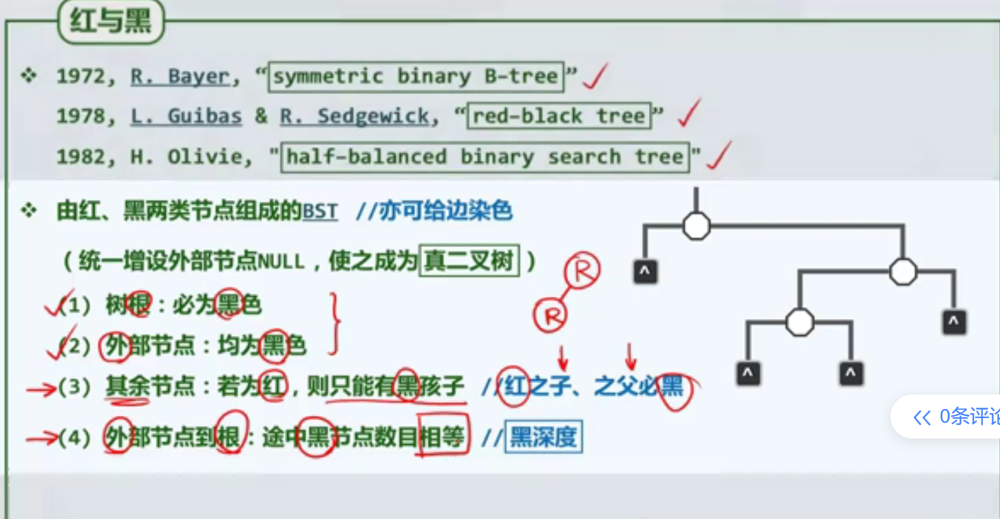
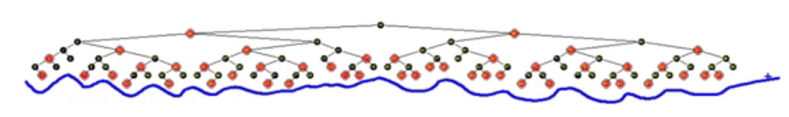
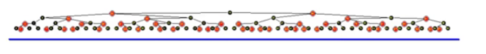
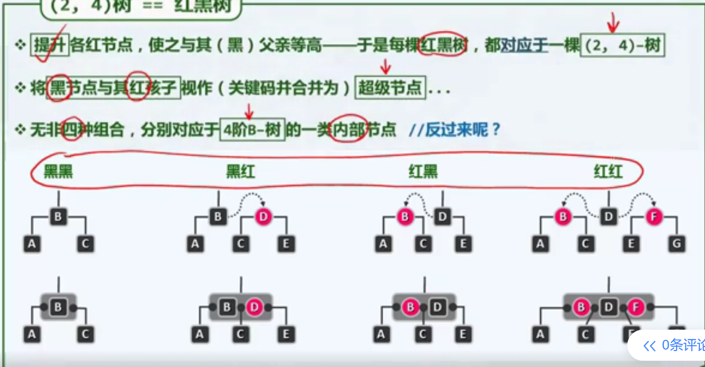
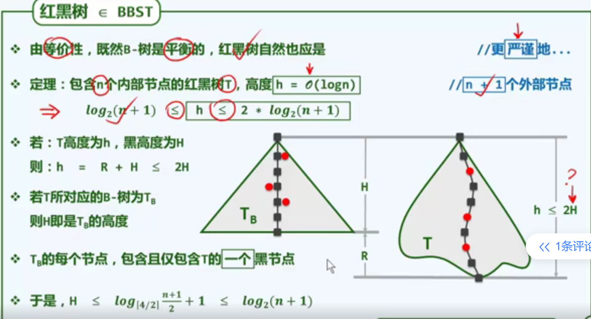
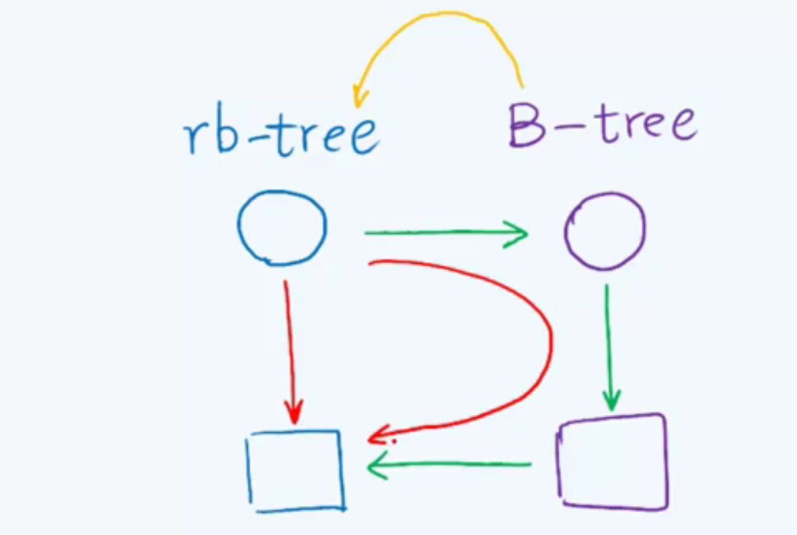
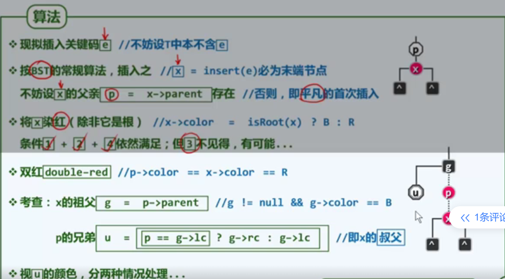

我们已经有了AVL树实现$logN$的时间复杂度，为什么还需要定义红黑树呢？

### 红黑树的结构

##### 基本定义

在历史上，很多人都给过红黑树的等价定义，也有很多不同的名字。这里我们提供一个最普遍的定义。

首先，如同B-树一样，我们给红黑树也需要提供外部节点，使之成为“真二叉树”，也就是所有节点都有两个孩子节点，无论孩子是真孩子还是外部节点。

红黑树的结构约束如下：

1. 根结点必须是黑色的。
2. 外部节点必须是黑色的。（前两条性质可以总结为：一个人的帽子和靴子都是黑色的）
3. 其余节点，若为红，则其孩子必须是黑色的。（这句话稍显晦涩，翻译成一个更加实用的版本是，不允许出现父子两代都为红色的情况。一个节点若为红色，其父子必都为黑色。）

4. 从根结点到每个外部节点的路径所包含的黑节点数目相等。

==这样的一系列定义，真的能形成我们所谓的红黑树吗？==

==以及看似让人毫无头绪的一系列定义，在其背后，又有什么简单的思想呢？==

##### 红黑树等价于(2,4)-树

为了更深刻的理解红黑树的结构，我们来对红黑树做提升变换（lifting）。其具体做法是，将每个红节点提升到与其父节点一样的高度。

观察变换前后的树结构，我们惊奇的发现，在进行如此的变换之后，所有叶子节点的高度，都变得相等。这一结构貌似之前也见过，那就是B-树。

任何两层结构都可简化成如上图所示的四种形式。对于黑色子节点，我们并不做提升，仍然让它作为子节点；而对于红色子节点，我们对其提升，与其父节点合并，称为一个超级节点。

由于红色节点并不连续出现，因此这种提升是相互独立并不递归的。其对应的根本原因是：连续的两层，至多只会有一层含有红色节点。

如此四种情况，所形成的超级节点关键码数量最小为1个，最大为3个。对应的分支数量至少为两个，至多为4个。这不正符合4阶B-树的定义吗？

##### 证明红黑树是BBST

对于一棵包含n个内部节点的BBST，其高度必须渐进于$logn$

因此我们必须证明，对于红黑树
$$
log_2(n+1)<=h<=2*log_2(n+1)
$$
==左侧不等式，对于任何的BST都成立。==

我们的目标是证明右侧不等式成立。

与B-树不同，红黑树的高度指的是其叶子节点的深度。黑高度指的是除去外部节点后黑节点的数量。**红黑树的黑高度等于带外部节点的对应的B-树的高度。**在上图中，黑高度为6，对应的B-树的高度也为6

设红黑树的黑高度为H，红高度为R，整体高度为h，由于红节点不能连续出现，因此在所有路径中，红色节点的数量一定小于等于黑色节点的数量。有：
$$
h = H+R <=2H
$$
同时，由之前我们对B-树高度的推导，有：
$$
H<=1+log_{\lceil m/2\rceil}(\frac {n+1}{2}) = 1+log_{2}(\frac {n+1}{2}) =log_2(n+1)
$$
因此，对于红黑树的高度h，我们有：
$$
h<=2H<=2*log_2(n+1)
$$
证明完毕。

### 红黑树的插入算法

